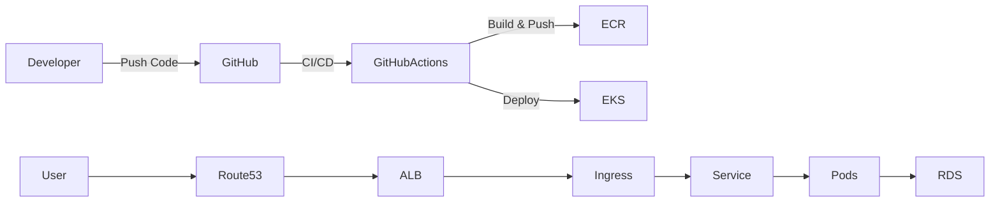

# 🚀 CivicTrack Backend – Production DevOps Deployment on AWS EKS

> A production-grade backend deployment demonstrating Docker, Kubernetes (EKS), CI/CD automation, ALB Ingress routing, and secure RDS integration.

---

## 📌 Project Overview

This project showcases the complete DevOps lifecycle of deploying a containerized **Node.js backend** to **AWS EKS (Kubernetes)** with:

* Automated CI/CD pipeline
* Docker containerization
* Secure secrets management
* HTTPS routing via ALB
* PostgreSQL RDS database
* Rolling zero-downtime deployments

The goal was to simulate a **real production cloud environment**, not just local development.

---

## 🏗 Architecture Diagram



---

## ⚙️ Tech Stack

### Backend

* Node.js
* Express.js
* JWT Authentication
* PostgreSQL

### DevOps

* Docker
* Kubernetes (AWS EKS)
* GitHub Actions (CI/CD)
* Amazon ECR
* AWS ALB Ingress Controller
* Route53
* AWS RDS (PostgreSQL)
* Trivy (Security scanning)

---

## 🚀 Features Implemented

✅ Dockerized backend service
✅ Kubernetes deployments & services
✅ ALB + Ingress for HTTPS routing
✅ PostgreSQL RDS integration
✅ Secure secrets using Kubernetes Secrets
✅ GitHub Actions CI/CD
✅ Rolling updates (zero downtime)
✅ Container security scanning (Trivy)
✅ Environment-based configuration
✅ Production-ready architecture

---

## 🔁 CI/CD Pipeline Flow

### Continuous Integration

1. Checkout code
2. Build Docker image
3. Scan image with Trivy
4. Push image to AWS ECR

### Continuous Deployment

5. Update image in EKS deployment
6. Rolling update pods
7. Health checks & readiness probes
8. Optional DB migrations

---

## 🐳 Docker

### Build

```bash
docker build -t civictrack-backend .
```

### Run

```bash
docker run -p 3000:3000 civictrack-backend
```

---

## ☸️ Kubernetes Deployment

### Apply manifests

```bash
kubectl apply -f k8s/
```

### Check pods

```bash
kubectl get pods
```

### Rolling update

```bash
kubectl set image deployment/civictrack-backend backend=<new-image>
```

---

## 🔐 Security Practices

* Secrets stored in Kubernetes Secrets
* Database SSL enabled
* HTTPS via ACM certificate
* No credentials hardcoded
* Trivy image vulnerability scanning
* JWT authentication

---

## 🧪 Example API Test

```bash
curl -X POST https://civictrack.mahipal.site/api/auth/login \
  -H "Content-Type: application/json" \
  -d '{"email":"admin@civictrack.gov.in","password":"Password123","role":"admin"}'
```

---

## 🧠 Key Learnings

During this project, I gained hands-on experience with:

* Kubernetes networking (Service vs Ingress vs ALB)
* Container orchestration
* CI/CD automation
* AWS IAM permissions
* Secure secret management
* Cloud-native deployments
* Production debugging & rollout strategies

---

## 🛠 Setup Steps (High Level)

1. Build Docker image
2. Push to ECR
3. Create EKS cluster
4. Deploy Kubernetes manifests
5. Configure ALB Ingress
6. Connect RDS
7. Configure DNS (Route53)
8. Enable CI/CD

---

## 📌 Status

✅ Infrastructure deployed and validated
✅ Login API tested successfully
✅ Database connected
✅ CI/CD operational
✅ Infrastructure teardown completed to optimize cost

---

## 👨‍💻 Author

Mahipal Singh Jhala
Backend & DevOps Engineer

---

# ⭐ Why this project?

This project demonstrates real-world DevOps practices including:

* Production cloud deployment
* Infrastructure automation
* Secure architecture
* CI/CD pipelines
* Container orchestration

Designed to simulate industry-grade systems rather than academic examples.

---